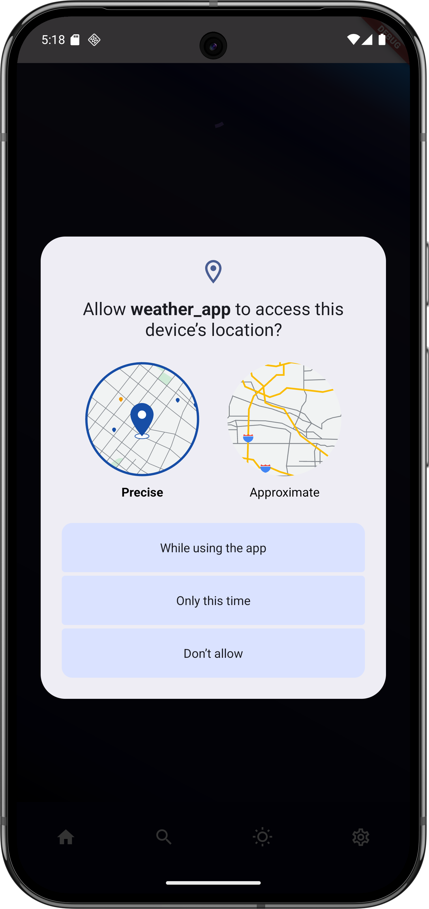
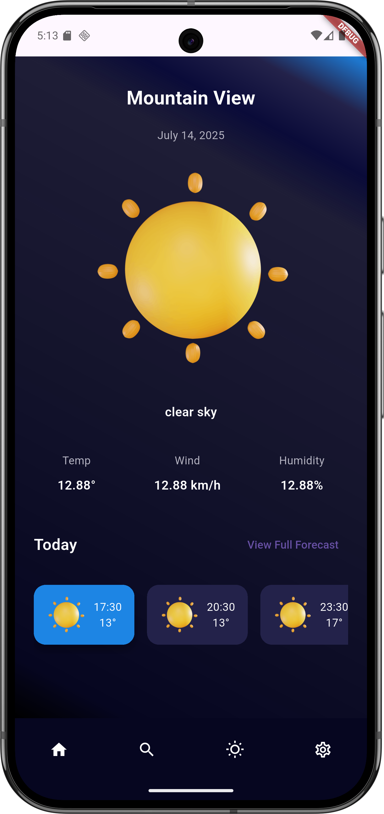
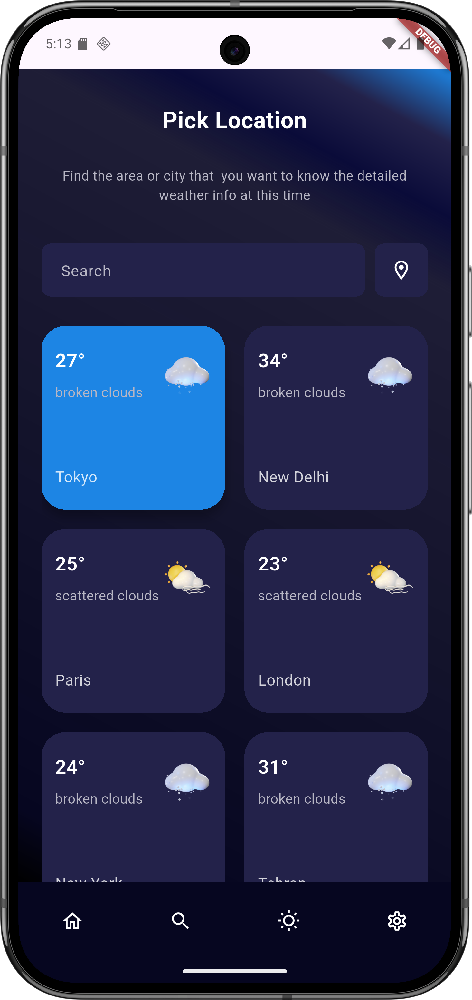
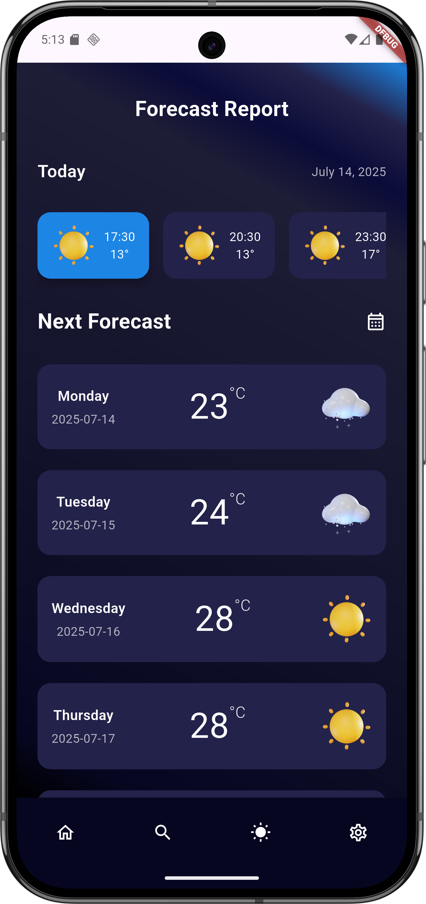

# 🌦️ Flutter Weather App

A beautifully designed weather app built using **Flutter**, **Riverpod**, and powered by the **OpenWeatherMap** and **Open-Meteo** APIs. It provides real-time current weather, hourly forecast, and weekly forecast data based on both city name and device location.

---

## 🚀 Features

✅ Fetch **current weather** by:
- Device location
- City name

✅ Fetch **hourly forecast** (OpenWeatherMap)  
✅ Fetch **7-day forecast** (Open-Meteo)  
✅ Displays **weather icons**, descriptions, and temperature ranges  
✅ Built with **Flutter Riverpod** for modern state management  
✅ Clean UI with responsive layout and Material theming  
✅ Graceful error handling and loading indicators

---

## 🔧 Tech Stack

| Tool / Package     | Purpose                        |
|--------------------|--------------------------------|
| [Flutter](https://flutter.dev) | Cross-platform app UI |
| [Riverpod](https://riverpod.dev) | State management      |
| [Dio](https://pub.dev/packages/dio) | HTTP client for APIs |
| [Geolocator](https://pub.dev/packages/geolocator) | Device location      |
| [Jiffy](https://pub.dev/packages/jiffy) | Date/time formatting |
| [OpenWeatherMap API](https://openweathermap.org/api) | Current + hourly weather |
| [Open-Meteo API](https://open-meteo.com/) | Weekly forecast      |

---

## 📦 Dependencies

```yaml
dependencies:
  flutter:
    sdk: flutter
  dio: ^5.8.0+1
  flutter_riverpod: ^2.6.1
  geolocator: ^14.0.2
  jiffy: ^6.4.3
```

---

## 🧠 Architecture Overview

- `ApiHelper`: Handles all API communication with OpenWeatherMap and Open-Meteo.
- `GeoLocator`: Requests and retrieves current location coordinates.
- Models: `Weather`, `HourlyWeather`, `WeeklyWeather` to decode API responses.
- Providers: `Riverpod` based providers to fetch, cache and expose data to the UI.
- UI: Components like `FamousCityTile` render city-specific weather data.

---

## 🌐 API Usage

### OpenWeatherMap
Used for:
- Current weather (`/weather` endpoint)
- Hourly forecast (`/forecast` endpoint)  
📘 [API Docs](https://openweathermap.org/api)

### Open-Meteo
Used for:
- 7-day forecast (`/forecast` endpoint)  
📘 [API Docs](https://open-meteo.com/)

---

## 📸 Screenshots

<table>
  <tr>
    <td></td>
    <td></td>
  </tr>
  <tr>
    <td></td>
    <td></td>
  </tr>
</table>

---

## 🛠️ Setup Instructions

1. **Clone the repository**
```bash
git clone https://github.com/your-username/weather-app.git
cd weather-app
```

2. **Add your OpenWeatherMap API key** in `constants.dart`:
```dart
class Constants {
  static const String apiKey = 'YOUR_API_KEY';
}
```

3. **Install dependencies**
```bash
flutter pub get
```

4. **Run the app**
```bash
flutter run
```

---

## 💡 Developer Tips

- Ensure location permissions are granted on the device.
- API rate limits apply, so consider caching for performance.
- Customize the theme using `AppColors` and text styles with `TextStyles`.

---

## 📃 License

MIT License © 2025 [Piyush]

---

## 🙌 Acknowledgements

- [OpenWeatherMap](https://openweathermap.org/)
- [Open-Meteo](https://open-meteo.com/)
- Flutter, Riverpod, Dio, and the open-source community
